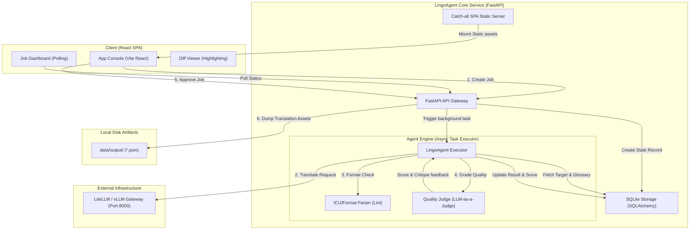
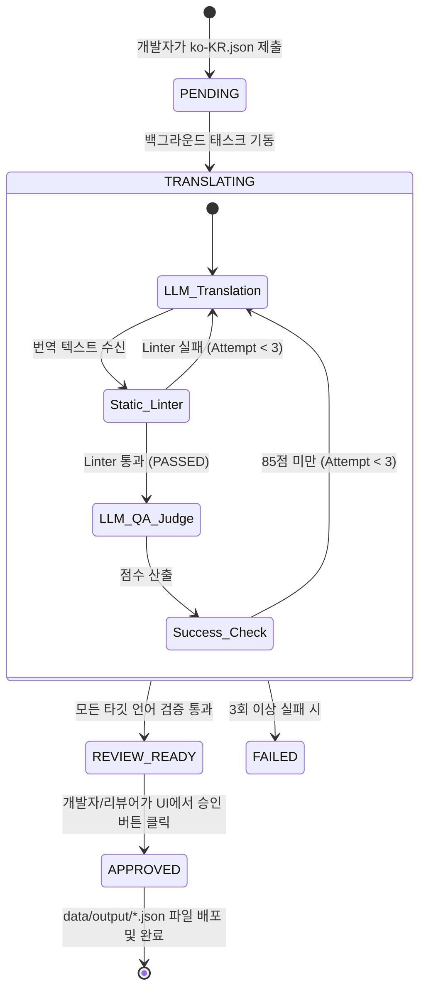
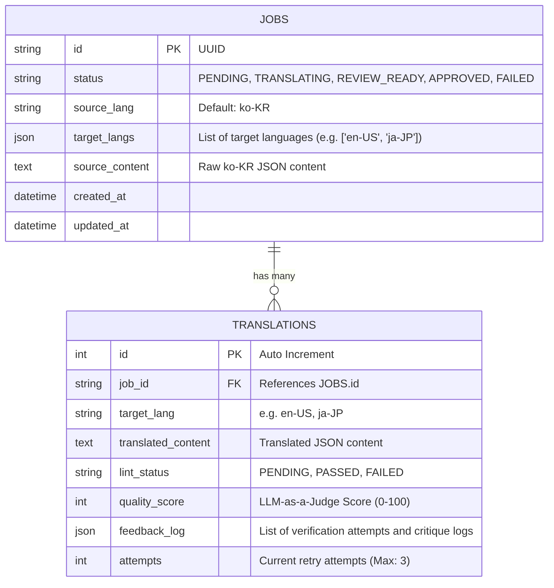

# LingoAgent System Architecture

LingoAgent는 다국어 번역 리소스(i18n Locale) 관리의 복잡성을 줄이고, 에이전트의 품질 검증 및 린팅을 통해 번역 배포 안정성을 높이는 **AI Localization DevOps Pipeline**입니다. 

본 문서는 LingoAgent 데모 프로젝트의 전체 시스템 설계, 내부 아키텍처 의사 결정 및 상세 데이터/제어 흐름을 명세합니다.

---

## 1. System Overview & Architecture Diagram

LingoAgent는 프론트엔드와 백엔드가 결합된 **싱글 컨테이너/싱글 프로세스 데모 아키텍처**를 채택했습니다. 복잡한 멀티컨테이너 네트워크 레이어를 생략하고 로컬/맥미니 환경에서 9095 단일 포트로 전체 라이프사이클을 테스트할 수 있도록 설계되었습니다.

---

## 2. 핵심 아키텍처 의사결정 (Architectural Decisions)

### ① NGINX / PostgreSQL 인프라 배제 및 싱글 포트 SPA Catch-all 구성
- **배경**: 데모 배포 시 NGINX 프록시와 PostgreSQL DB를 Compose로 띄우는 구조는 로컬 네트워크 환경(특히 192.168.x.x 대역의 포트 충돌 및 IP 변동)에서 오류를 빈번하게 유발합니다.
- **결정**: 
  - FastAPI의 static mount 기능과 catch-all 라우터(`spa_fallback`)를 결합하여 **프론트엔드 빌드본(`dist`)을 백엔드가 단일 포트(9095)에서 직접 서빙**하도록 강제했습니다.
  - 데이터는 파일 기반인 **SQLite**를 사용해 영속성을 유지하되, SQLAlchemy 세션을 활용해 추후 엔터프라이즈 마이그레이션이 용이하도록 오알엠 레이어를 격리했습니다.

### ② ICU 메시지 포맷 검증 린터 (Static Linter) 선행 검증
- **배경**: LLM 번역 결과물에서 다국어 치환 변수(예: `{count}`, `{username}`)가 멋대로 다른 언어로 번역되거나 유실되는 경우가 빈번합니다.
- **결정**: 
  - 무조건적인 LLM 품질 채점 이전에 백엔드에서 정규식 기반의 **구문 린팅(`lint_translation`)을 선행**하도록 설계했습니다.
  - 변수의 짝이 맞지 않거나 훼손된 경우 곧바로 `FAILED` 판정을 내리고 에이전트 내부적으로 이전 오류 사유를 프롬프트에 동적 반영하여 자동 재번역을 시도합니다. 이로써 불필요한 LLM QA 리뷰 API 호출 횟수를 대폭 절감했습니다.

### ③ LLM Gateway 장애 극복 및 시뮬레이션 Fallback (Durable Demo)
- **배경**: 포트폴리오 시연 도중 네트워크 장애 또는 외부 LLM API(LiteLLM) 연동 실패로 인해 데모 전체가 마비되는 리스크가 존재합니다.
- **결정**: LLM Gateway 연결 실패 시 예외를 잡아 내부 로컬 규칙 기반 번역 시뮬레이터(`simulate_fallback_translation`)로 자동 우회하도록 예외 처리 구조를 짰습니다. 외부 API 상태와 무관하게 프론트엔드 대시보드에서 에이전트가 돌고 승인되는 흐름은 언제나 완결성 있게 시연됩니다.

---

## 3. 데이터 흐름 및 상태 전이 (State Transitions)

번역 작업(`Job`)은 생성부터 배포까지 다음과 같은 상태 흐름을 가집니다.

---

## 4. 데이터베이스 엔티티 구조 (Entity Relationship Diagram)

SQLite에 적재되는 테이블 스키마 구조입니다.

---

## 5. API 명세 (Key API Endpoints)

| Method | Endpoint | Description | Payload / Response |
| :--- | :--- | :--- | :--- |
| **POST** | `/api/jobs` | 신규 번역 작업 요청 (에이전트 구동) | Input: `JobCreate` / Response: `JobResponse` |
| **GET** | `/api/jobs` | 번역 작업 목록 조회 (대시보드 리스트) | Response: `List[JobResponse]` |
| **GET** | `/api/jobs/{job_id}` | 작업 진행 상황 상세 폴링 및 결과 조회 | Response: `JobResponse` |
| **POST** | `/api/jobs/{job_id}/approve` | 다국어 리소스 최종 파일 배포 승인 | Response: `JobResponse` |
| **DELETE** | `/api/jobs/{job_id}` | 번역 작업 및 연관 번역 이력 삭제 | Response: `{"detail": "Job successfully deleted"}` |
